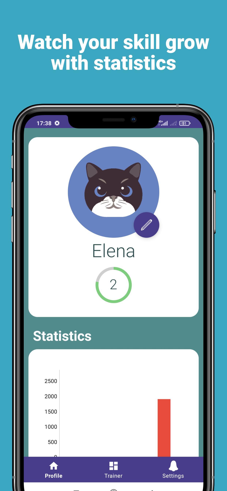
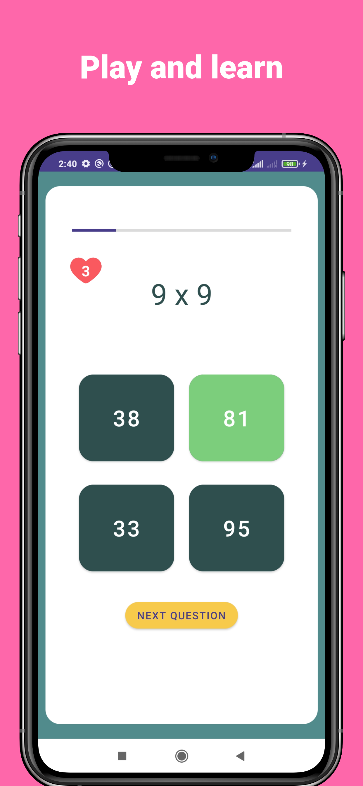
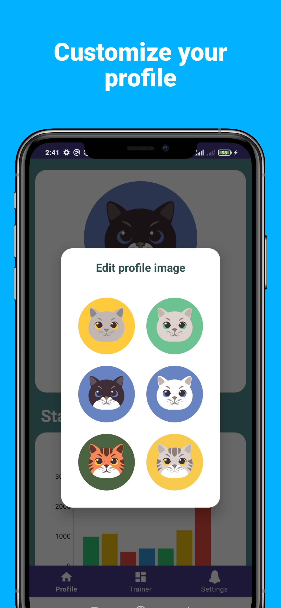
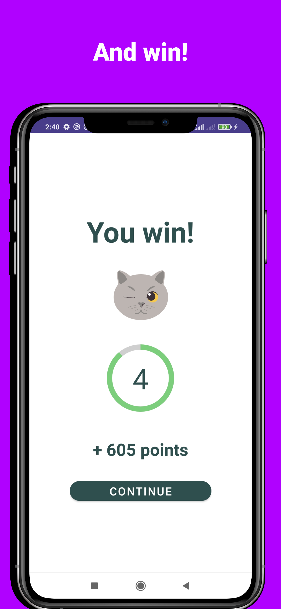

# Multiplication Trainer App

<table>
  <tr>
    <td></td>
    <td></td>
    <td></td>
    <td></td>
  </tr>
</table>


The Multiplication Table Trainer is a mobile application designed to help users practice and improve their multiplication skills. 

## Features

- Practice multiplication tables from 1 to 9.
- Interactive quizzes with randomly generated questions.
- Real-time feedback on correct and incorrect answers.
- Track your progress with dynamic charts.
- User-friendly interface for a smooth learning experience.

## Technologies and Libraries

- Kotlin programming language for the application's logic.
- XML for designing the user interface.
- Glide for efficient loading and caching of images.
- MPAndroidChart for creating interactive and informative charts.

## Installation and Setup

1. Clone the repository to your computer:

   ```bash
   git clone https://github.com/yourusername/multiplication-table-trainer.git
   ```
2. Open the project in Android Studio.

3. Run the app on an emulator or a physical device.

4. Start practicing your multiplication tables and track your progress!
   
## Author
Tyomnayark

If you have any questions, suggestions, or bug reports related to the app, please feel free to contact me at tyomnayark@gmail.com.
